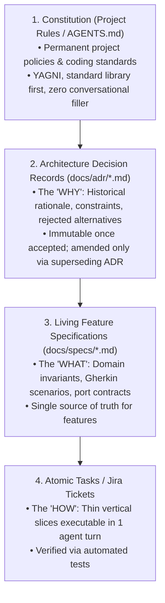

# Architecture Decision Records (ADRs) & Spec-Driven Development (SDD) Guide

> **Objective**: The definitive enterprise framework for authoring **Architecture Decision Records (ADRs)** and **Living Specifications (Specs)** to guide human engineers and autonomous AI agents without ambiguity, requirement drift, or context bloat. Incorporates best practices from **GitHub Spec Kit** (`github/spec-kit`), **Michael Nygard ADRs**, and **Spec-Driven Development (SDD)**.

---

## 1. The Living Documentation Hierarchy

In AI-assisted software engineering, agents are literal-minded. If architectural intent and acceptance criteria live only in Slack threads or human memory, agents will hallucinate, re-invent dead patterns, or write conflicting code.



| Artifact | Location | Answers | Mutability | Agent Role |
| :--- | :--- | :--- | :--- | :--- |
| **Constitution** | `AGENTS.md` / `CLAUDE.md` | *How do we build?* | High stability | System instructions (checked every turn) |
| **ADR** | `docs/adr/ADR-XXX.md` | *Why did we choose this?* | Immutable (or superseded) | Architectural guardrail (prevents forbidden patterns) |
| **Spec** | `docs/specs/SPEC-XXX.md` | *What must it do?* | Living (updated with feature) | Implementation blueprint |
| **Task / Ticket** | Jira / GitHub Issue | *What is the next commit?* | Ephemeral (closed when done)| 1-turn execution target |

---

## 2. Architecture Decision Records (ADRs)

An ADR captures an important architectural decision, along with its context, alternatives considered, and consequences.

### When to Write an ADR:
* Introducing a new framework, library, or language version.
* Choosing a persistent data store or communication protocol (REST vs. gRPC vs. Event-driven).
* Enforcing architectural patterns (Hexagonal Architecture, CQRS, zero-ORM policy).
* Establishing security boundaries or data compliance rules.
* **Do NOT write an ADR for**: Trivial refactors, standard bug fixes, or day-to-day implementation details.

### The Canonical ADR Template (`docs/adr/ADR-001-template.md`)

```markdown
# ADR-001: [Short Title of Architectural Decision]

* **Status**: [PROPOSED | ACCEPTED | DEPRECATED | SUPERSEDED by ADR-XXX]
* **Date**: YYYY-MM-DD
* **Deciders**: [Author / Team Members]
* **Consulted**: [Key Stakeholders]

## 1. Context & Problem Statement
What problem are we trying to solve? What technical, business, or operational forces are driving this decision? (2–3 paragraphs describing the constraints).

## 2. Decision Drivers
* Driver 1: e.g. Must support 10,000 req/sec with p99 latency < 20ms.
* Driver 2: e.g. Must run offline with zero external network dependencies.
* Driver 3: e.g. Must minimize LLM token consumption across AI agents.

## 3. Considered Options
* Option 1: [Option Name]
* Option 2: [Option Name]
* Option 3: [Option Name]

## 4. Decision Outcome
Chosen option: **[Option Name]**, because [justification linking to decision drivers].

### Detailed Architecture & Rules
[Concrete architectural rules and patterns that all code must follow].

## 5. Pros and Cons of the Options

### [Option 1 - Chosen]
*  Positive: [Key benefit]
*  Positive: [Key benefit]
* ⚠️ Negative: [Trade-off or cost accepted]

### [Option 2 - Rejected]
*  Positive: [Benefit]
* ❌ Negative: [Critical flaw or unacceptable constraint]

## 6. Compliance & Automated Verification
How will we ensure this decision is never violated in code?
* CI Check / Linter: [e.g. Architecture test using ArchUnit or graph_fy blast radius check]
* Invariant Rule: [e.g. Domain layer must have zero imports from infrastructure package]
```

---

## 3. Spec-Driven Development (SDD) & GitHub Spec Kit

Spec-Driven Development (SDD) treats specifications as the **single source of truth** driving AI agent generation. Instead of writing prompts that drift over time, you write structured specifications.

### The 4-Phase SDD Lifecycle:
1. **Specify (`/speckit-specify`)**: Define requirements, business value, user personas, and strict non-goals.
2. **Plan (`/speckit-plan`)**: Design domain models, port interfaces, data schemas, and link to existing ADRs.
3. **Tasks (`/speckit-tasks`)**: Slice the plan into atomic, testable work items.
4. **Implement & Converge (`/implement`)**: Agent writes tests first (TDD), implements minimal surgical code, passes tests, and verifies against the spec.

---

## 4. The Canonical Feature Specification Template (`docs/specs/`)

Place feature specifications in `docs/specs/SPEC-XXX-<feature-name>.md`:

```markdown
# SPEC-042: Idempotent Payment Webhook Processing

* **Status**: APPROVED
* **Author**: Engineering Lead
* **Related ADR**: [ADR-003: Stripe Webhook Security & Idempotency](../adr/ADR-003.md)
* **Target Subsystem (graph_fy)**: `BillingEngine`
* **Target Package**: `packages/billing-core`

---

## 1. Overview & Non-Goals

### Purpose
Process asynchronous payment webhooks from Stripe reliably, ensuring exactly-once business execution even when duplicate webhook deliveries occur.

### Non-Goals (Scope Shield)
* ❌ This spec does NOT implement PayPal or Apple Pay (future spec).
* ❌ This spec does NOT trigger user notification emails (handled asynchronously by notification worker).

---

## 2. Ubiquitous Language & Domain Types

* `WebhookEventId`: String (Stripe event ID starting with `evt_`)
* `PaymentId`: UUID (Internal payment identifier)
* `PaymentStatus`: Enum (`PENDING`, `SUCCEEDED`, `FAILED`)
* `IdempotencyRecord`: Value Object `(eventId, processedAt, responseStatus)`

---

## 3. Business Invariants (Strict)

Every implementation must satisfy these invariants without exception:
1. `INV-PAY-01`: A webhook with an already-processed `WebhookEventId` must return HTTP 200 immediately without executing business logic.
2. `INV-PAY-02`: If webhook cryptographic signature is invalid, reject with HTTP 401 before any database lookup.
3. `INV-PAY-03`: Payment status transitions are one-way: `PENDING` ➔ `SUCCEEDED` or `FAILED`. A `SUCCEEDED` payment can never transition to `FAILED`.

---

## 4. Port Interfaces (Hexagonal Ports)

```java
// Inbound Port (Use Case)
public interface ProcessPaymentWebhookUseCase {
    WebhookProcessingResult process(String rawPayload, String signatureHeader);
}

// Outbound Ports (Adapters implement these)
public interface WebhookEventRepository {
    boolean existsByEventId(String eventId);
    void recordEvent(String eventId, PaymentStatus status);
}

public interface PaymentRepository {
    Optional<Payment> findById(UUID paymentId);
    Payment save(Payment payment);
}
```

---

## 5. Acceptance Criteria (Given-When-Then / Gherkin)

```gherkin
Feature: Payment Webhook Processing

  Scenario: Valid new payment success webhook
    Given no webhook with eventId "evt_100" exists in WebhookEventRepository
    And a Payment with id "pay-100" is in status "PENDING"
    When ProcessPaymentWebhookUseCase is invoked with valid signature and payload for "evt_100"
    Then Payment "pay-100" status is updated to "SUCCEEDED"
    And WebhookEventRepository records "evt_100" as processed
    And return result status is SUCCESS

  Scenario: Duplicate webhook delivery (Idempotency)
    Given a webhook with eventId "evt_100" already exists in WebhookEventRepository
    When ProcessPaymentWebhookUseCase is invoked with payload for "evt_100"
    Then PaymentRepository is never updated
    And return result status is DUPLICATE_IGNORED

  Scenario: Invalid webhook signature
    Given an incoming webhook with an untrusted or tampered signature
    When ProcessPaymentWebhookUseCase is invoked
    Then SecurityException is thrown
    And no database read or write occurs
```

---

## 6. Verification Command
The agent must verify this spec using this exact quiet command:
```bash
./gradlew :packages:billing-core:test --tests "*PaymentWebhookTest" --quiet
```
```

---

## 5. How ADRs, Specs, and AI Agents Interact

When an AI agent executes tasks, feed it both the ADR and the Spec:

```
[Developer Prompt]
"Implement task 1 of SPEC-042 (docs/specs/SPEC-042-payment-webhook.md).
Adhere strictly to architectural constraints in docs/adr/ADR-003.md and AGENTS.md rules."
```

### The Agent's Execution Path:
1. **Reads ADR-003**: Learns that all webhook signatures must use constant-time comparisons (`MessageDigest.isEqual`) and no foreign ORM dependencies are allowed in domain logic.
2. **Reads SPEC-042**: Learns the exact invariants (`INV-PAY-01`, `INV-PAY-02`) and Gherkin scenarios.
3. **Calls `graph_fy get_agent_context`**: Retrieves the `BillingEngine` subsystem AST skeleton and callers.
4. **Writes Failing Unit Test**: Implements tests directly mirroring the Gherkin scenarios.
5. **Writes Minimal Code (`ponytail`)**: Implements only the code necessary to pass the tests.
6. **Validates Blast Radius**: Calls `graph_fy get_impact_analysis` to ensure no unexpected downstream breakage.

---

## 6. Preventing Spec Drift (Living Documentation)

Living documentation stays accurate only if code and specs evolve together:

1. **Spec-First Changes**: If requirements change mid-flight, update the Gherkin scenario in `SPEC-XXX.md` **before** prompting the agent to change code.
2. **PR Review Checklist**:
   * [ ] Does the PR diff match the acceptance criteria in the spec?
   * [ ] Were any new architectural patterns introduced? If yes, is an ADR attached?
   * [ ] Did `graph_fy get_diff_context` show any unexpected blast radius into unrelated communities?
