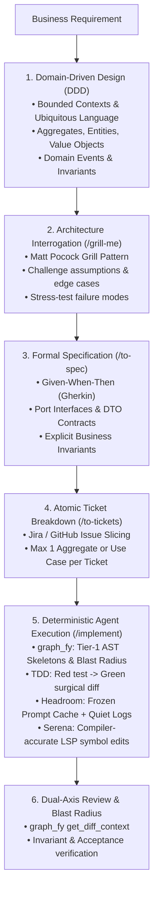

# From Domain-Driven Design (DDD) to Specs to Code: The Enterprise AI Blueprint

> **Objective**: The authoritative end-to-end framework for turning high-level business requirements into enterprise-grade code via **Domain-Driven Design (DDD)**, **Structured Specs (Jira)**, **Matt Pocock's AI Skills**, and **Deterministic Agent Execution (`graph_fy` + `headroom` + `serena`)**.

---

## 1. The End-to-End Pipeline



---

## 2. Phase 1: Domain-Driven Design (DDD) Modeling

Before writing a single Jira ticket or prompt, define the domain mechanics.

### Core DDD Building Blocks:
1. **Ubiquitous Language**: A single, unambiguous glossary shared by business stakeholders and code (e.g. `Order`, `Fulfill`, `Cancel`, `LineItem` — never interchangeably call it `Purchase` or `Transaction`).
2. **Bounded Contexts**: Clear boundaries isolating domains (e.g. `BillingContext` vs. `InventoryContext` vs. `FulfillmentContext`). In `graph_fy`, each bounded context maps directly to a **Leiden community**.
3. **Aggregates & Aggregate Roots**: Clusters of domain objects treated as a single unit for data changes (e.g. `Order` is the root; `OrderItem` cannot exist or be modified outside `Order`).
4. **Entities vs. Value Objects**:
   * **Entity**: Has an explicit identity that persists over time (e.g. `CustomerId`, `OrderId`).
   * **Value Object**: Immutable, identified purely by its attributes (e.g. `Money(amount, currency)`, `Address`, `Email`).
5. **Domain Invariants**: Business rules that must **always** be true (e.g. *"An order total cannot be negative"*, *"Cannot cancel an order already shipped"*).

---

## 3. Phase 2: The Interrogation (/grill-me & Matt Pocock Pattern)

Never let an AI agent jump straight from a vague prompt into code. Use the **Matt Pocock `/grill-me`** skill pattern to challenge requirements.

### How to Grill the Plan:
Before writing the spec, prompt Claude or your agent:
> *"Grill me on this domain plan. Ask me 4 tough questions about edge cases, race conditions, invariant violations, and failure modes. Do not write code."*

### Key Areas to Interrogate:
* **State Transitions**: What happens if a duplicate payment webhook arrives after an order is fulfilled?
* **Invariant Boundaries**: Where is the validation enforced? (Inside the Aggregate, never scattered in controllers).
* **Failure Semantics**: If the downstream inventory reservation fails, does the order roll back or transition to `PAYMENT_PENDING_INVENTORY_FAILED`?

---

## 4. Phase 3: Specification Engineering (/to-spec)

Convert the grilled domain model into an unambiguous, formal specification (`docs/specs/<feature>.md`).

### Enterprise Spec Template:
```markdown
# Spec: Order Fulfillment Lifecycle
**Bounded Context**: Fulfillment
**Aggregate Root**: `Order`
**Leiden Community (graph_fy)**: `FulfillmentEngine`

### 1. Ubiquitous Language & Types
- `OrderId`: Value Object (UUID)
- `OrderStatus`: Enum (`DRAFT`, `PAID`, `FULFILLED`, `CANCELLED`)
- `Money`: Value Object (`BigDecimal amount`, `Currency currency`)
- `OrderItem`: Value Object (`Sku sku`, `int quantity`, `Money price`)

### 2. Domain Invariants (Strict)
1. `INV-01`: An Order cannot be fulfilled unless status == `PAID`.
2. `INV-02`: Total order quantity must be > 0 and <= 100 items.
3. `INV-03`: Fulfilling an already `FULFILLED` order is idempotent (no-op, return success).

### 3. Ports (Interfaces Only)
- `OrderRepository`: `findById(OrderId) -> Optional<Order>`, `save(Order) -> Order`
- `InventoryPort`: `reserve(List<OrderItem>) -> ReservationResult`
- `EventPublisherPort`: `publish(DomainEvent) -> void`

### 4. Given-When-Then Acceptance Criteria (Gherkin)
Scenario: Successful Order Fulfillment
  Given an Order with ID "ord-123" in status "PAID"
  When FulfillOrderUseCase is executed with OrderId "ord-123"
  Then Order status changes to "FULFILLED"
  And InventoryPort.reserve is called once with order items
  And an OrderFulfilledEvent is published to EventPublisherPort
  And the Order is saved to OrderRepository

Scenario: Attempting to Fulfill Unpaid Order
  Given an Order with ID "ord-456" in status "DRAFT"
  When FulfillOrderUseCase is executed with OrderId "ord-456"
  Then InvariantViolationException is thrown with code "ORDER_NOT_PAID"
  And InventoryPort is never called
```

---

## 5. Phase 4: Atomic Ticket Slicing (Jira / GitHub Issues)

Break the spec into vertical, atomic tickets. **Rule**: A single ticket must touch at most **one layer or aggregate** and fit in **one agent turn (under 1,000 tokens)**.

```
Epic: Order Fulfillment
├── TICKET-1: Domain Model & Invariants (Order.java, OrderStatus.java, Money.java)
├── TICKET-2: Domain Ports (OrderRepository.java, InventoryPort.java)
├── TICKET-3: Use Case & Unit Tests (FulfillOrderUseCase.java + Test)
└── TICKET-4: Infrastructure Adapters (JpaOrderRepositoryAdapter.java)
```

### Jira Ticket Format:
* **Title**: `[Fulfillment] Implement FulfillOrderUseCase with TDD`
* **Context**: Link to `docs/specs/order-fulfillment.md`
* **Acceptance Criteria**: Copy the exact Gherkin scenario.
* **Verification Command**: `./gradlew test --tests "*FulfillOrderUseCaseTest" --quiet`

---

## 6. Phase 5: Deterministic Agent Execution (/implement)

Claude executes the ticket using our **3-tool optimization stack**:

```bash
headroom wrap claude
```

### The 5-Step Agent Loop:
1. **Pre-Agent Context (`graph_fy`)**:
   Agent calls `graph_fy get_agent_context(task="FulfillOrderUseCase")`.
   * Gets existing port interfaces and AST skeletons.
   * Gets blast radius and affected downstream tests.
2. **Write Failing Test First (TDD)**:
   Agent implements unit test matching the Gherkin scenario.
3. **Execute Quiet Test**:
   Agent runs test with `--quiet`. Fails (Red).
4. **Implement Surgical Diff (`ponytail`)**:
   Agent writes only the code necessary to pass the test using Serena's `replace_symbol_body` or targeted AST edits.
5. **Verify & Sync**:
   Test passes (Green). Agent runs `graph_fy update .` to keep knowledge graph current (0 API cost).

---

## 7. Phase 6: Dual-Axis Review & Blast Radius

Before submitting a Pull Request:
1. **Spec Alignment**: Did the implementation satisfy all domain invariants (`INV-01`, `INV-02`) and Gherkin scenarios?
2. **Blast Radius Analysis**:
   Run `graph_fy get_diff_context` (or `graph_fy diff HEAD~1`).
   * Verifies that only expected 1-hop callers were touched.
   * Confirms no unexpected regressions in unrelated communities.
3. **Git Hygiene**: Clean commit, PR opened against protected `main`.

---

## 8. Summary: The 10x Enterprise Workflow

| Phase | Human Role | AI Agent Role | Key Tool / Skill |
| :--- | :--- | :--- | :--- |
| **1. Domain Modeling** | Defines business terminology & boundaries | Validates DDD structure | Ubiquitous Language / Bounded Contexts |
| **2. Interrogation** | Answers architectural edge cases | Challenges assumptions & failure modes | Matt Pocock `/grill-me` |
| **3. Specification** | Approves invariants & Gherkin scenarios | Generates formal spec & port interfaces | `/to-spec` |
| **4. Ticket Slicing** | Prioritizes Jira backlog | Slices vertically into atomic tasks | `/to-tickets` |
| **5. Implementation** | Provides spec file path | Writes tests, implements code, passes tests | `graph_fy` + `headroom` + `serena` |
| **6. Review** | Merges verified PR | Verifies blast radius & invariants | `graph_fy get_diff_context` |
