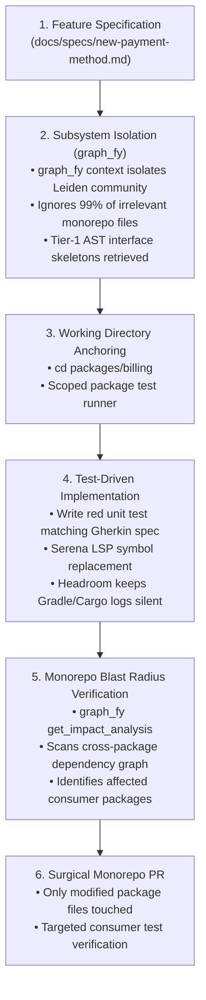

# Massive Monorepo Feature Addition Playbook (On a $10 Claude Budget)

> **Objective**: How to autonomously build production features in massive enterprise monorepos (10,000 to 500,000+ files) using **Claude**, spending **under $0.15 per feature**, with zero hallucinations and zero exploratory context blowouts.

---

## 1. Why Monorepos Bankrupt AI Coding Agents

In standard single-repository projects, an agent can often recover from blind searches. In a massive monorepo, unoptimized agents fail immediately:

```
❌ Monorepo Anti-Patterns:
• Running `grep -r` or `find .`            ➔ Dumps 50,000 lines of filepaths (Context blowup)
• Running root test (`bazel test //...`)     ➔ 45-minute execution + 30,000 tokens of noisy logs
• Reading raw files across package boundaries ➔ Burns $5.00 in 2 turns trying to find where a type lives
• Incomplete mental model                     ➔ Agent breaks 4 downstream consumer packages unknowingly
```

### The $0.15 Monorepo Formula:
```
1 Subsystem Briefing (graph_fy)    ➔ 1,500 tokens ($0.015)
1 Isolated Package TDD Turn (Serena) ➔   800 tokens ($0.008)
1 Surgical Implementation Diff     ➔   400 tokens ($0.006)
1 Blast Radius Verification Check   ➔ 1,000 tokens ($0.010)
------------------------------------------------------------
Total Cost for Complete Monorepo Feature: ~$0.04 to $0.15
```

---

## 2. The 5-Step Monorepo Engineering Protocol



---

## 3. Step-by-Step Monorepo Execution

### Step 1: Subsystem Pinpoint & Boundary Pruning (`graph_fy`)
Before letting Claude touch code, isolate the specific Leiden community in the monorepo:

```bash
# Pinpoints the exact subsystem, God nodes, and existing contracts in 1 second
graph_fy context "add Stripe refund webhook listener"
```
Or via Claude's MCP:
```json
get_agent_context(task="add Stripe refund webhook listener")
```

* **What happens**: `graph_fy`'s Leiden clustering ignores all 90,000 unrelated files (frontend, auth, data pipelines, analytics) and returns **only** the 4–6 relevant classes/interfaces in `packages/billing-core`.
* **Tokens spent**: **1,500 tokens** (instead of 80,000 tokens of blind directory walking).

---

### Step 2: Anchor Claude to the Sub-Package
In massive monorepos, running commands from the root directory kills performance and floods context.

**Force Claude to anchor to the sub-package in your prompt**:
> *"Work strictly within `packages/billing-core`. Implement `docs/specs/refund-webhook.md`. Do not execute root-level builds."*

Configure package-scoped commands:
* **Gradle Monorepo**: `./gradlew :packages:billing-core:test --quiet`
* **Turborepo / pnpm**: `pnpm --filter billing-core test`
* **Bazel**: `bazel test //packages/billing-core:...`
* **Cargo Workspace**: `cargo test -p billing-core --quiet`

---

### Step 3: Interface-First Expansion (Native CCR)
If Claude needs to inspect an existing interface in another monorepo package (e.g. `packages/common-events`), **never let it read the full file**:

Use the on-demand handle embedded by `graph_fy`:
```json
get_symbol_implementation(node_id_or_symbol="common_events_PaymentEvent")
```
* **Result**: Claude retrieves only the 10-line interface signature. The 500 lines of implementation logic in `common-events` remain unread.

---

### Step 4: Atomic Refactoring via Serena (LSP)
When adding code that touches existing monorepo symbols, use Serena's LSP engine rather than full file rewrites:

```json
serena.find_referencing_symbols(name_path_pattern="PaymentProcessor/processRefund")
```
* Uses compiler-level Language Server Protocol (JDTLS, Pyright, rust-analyzer, tsserver) to identify exact references across the monorepo.
* Executes surgical replacement via `serena.replace_symbol_body`.

---

### Step 5: Downstream Blast Radius Check (The Regression Shield)
This is where 90% of monorepo breakages happen: an engineer changes a method in `packages/billing-core` and accidentally breaks `apps/mobile-api` or `services/subscription-worker`.

Before opening a PR, Claude runs:
```json
get_impact_analysis(target_symbol="RefundService_execute")
```

`graph_fy` calculates the BFS downstream dependency graph across the entire monorepo:
```
Blast Radius Risk: MEDIUM (Downstream Dependents: 3)
Affected Consumer Packages:
  - apps/mobile-api
  - services/subscription-worker
Affected Verification Targets (Tests):
  - apps/mobile-api/test/RefundControllerTest.java
  - services/subscription-worker/test/RefundWorkerTest.java
```

**Claude runs ONLY those 2 affected downstream tests**:
```bash
./gradlew :apps:mobile-api:test --tests "RefundControllerTest" --quiet
./gradlew :services:subscription-worker:test --tests "RefundWorkerTest" --quiet
```
* **Time taken**: 15 seconds.
* **Tokens spent**: 400 tokens.
* **Guarantee**: Full monorepo compatibility verified without running a 45-minute full build!

---

### Step 6: Fast Local Knowledge Graph Sync
After changes are verified:
```bash
graph_fy update packages/billing-core
```
Updates the monorepo AST graph locally in ~1.5 seconds with zero external calls and zero API cost.

---

## 4. Monorepo Configuration Template (`AGENTS.md`)

Drop this into your monorepo root:

```markdown
# AGENTS.md - Monorepo Execution Rules

## 1. Monorepo Boundary Isolation
- NEVER run root-level directory scans (`find .`, `ls -R`, `grep -r`).
- ALWAYS query `graph_fy get_agent_context(task="...")` to identify the target package and community.
- Work strictly inside the isolated package directory (`packages/<package_name>`).

## 2. Package-Scoped Build & Test Commands
- NEVER run full monorepo test suites (`bazel test //...`, `./gradlew test`, `npm test`).
- Run only the target package test command with quiet flags:
  - Gradle: `./gradlew :packages:<name>:test --quiet`
  - pnpm: `pnpm --filter <name> test`
  - Cargo: `cargo test -p <name> --quiet`

## 3. Cross-Package Blast Radius Verification
- Before finishing any feature, call `graph_fy get_impact_analysis(target_symbol="<symbol>")`.
- Run ONLY the specific downstream test targets reported by graph_fy to verify consumers.

## 4. Native CCR & Serena Symbol Navigation
- Use `graph_fy get_symbol_implementation` for on-demand signature expansion.
- Use Serena's `find_symbol` and `replace_symbol_body` for atomic edits.

## 5. Caveman Output & Ponytail Simplicity
- Zero conversational output. Code diffs and shell commands only.
- Strict YAGNI. Write only the minimal logic specified in the spec.
```

---

## 5. Monorepo Economics Summary

| Monorepo Operation | Unoptimized Agent Cost | `graph_fy` + `headroom` + `serena` Cost |
| :--- | :--- | :--- |
| **Locating target files** | 40k tokens (~$0.12) | 1.5k tokens (~$0.015) |
| **Reading dependencies** | 60k tokens (~$0.18) | 500 tokens ($0.005 via CCR) |
| **Running tests** | 20k tokens (~$0.06 logs) | 200 tokens ($0.002 via Headroom quiet) |
| **Regression testing** | 50k tokens (full suite) | 800 tokens ($0.008 via targeted blast radius) |
| **Total Cost per Feature** | **~$0.45 – $2.00+** | **~$0.03 – $0.08** |
| **Capacity on $10 Budget** | **5–15 features max** | **120–250+ enterprise features** |
