# The Deterministic, Token-Efficient AI Engineer's Blueprint

> **Objective**: Eliminate 80–95% of LLM token costs, prevent hallucinations, preserve prompt caching, and produce clean, senior-grade code using **`graph_fy`**, **`headroom`**, **`serena`**, **`ponytail`**, and **`caveman`**.

---

## 1. The Anatomy of AI Coding Waste

Why do AI coding sessions become expensive, slow, and prone to hallucinations?

```mermaid
flowchart TD
    subgraph Waste["The Legacy Wasteful Loop (50k–150k tokens)"]
        W1["Agent reads 15 whole files to explore codebase\n(40,000 tokens)"] --> W2["Agent runs full test suite with verbose passing logs\n(15,000 tokens)"]
        W2 --> W3["Slight edits invalidate prompt cache prefix\n(Lose 90% cache discount)"]
        W3 --> W4["Agent generates speculative boilerplate & helpers\n(Over-engineering / context bloat)"]
    end

    subgraph Efficient["The Deterministic Blueprint (3k–8k tokens)"]
        E1["graph_fy context briefing (AST skeletons, God nodes, call graph)\n(1,500 tokens)"] --> E2["Targeted edit via LSP/AST symbol jumps (Serena)\n(500 tokens)"]
        E2 --> E3["Headroom preserves prompt cache & filters shell output\n(90% read discount + CCR)"]
        E3 --> E4["Ponytail enforces standard library & surgical diff\n(Zero dead abstractions)"]
    end
```



Three core leaks drive token explosion:
1. **Exploratory Blind Reads**: Reading whole files just to understand function signatures and call hierarchies.
2. **Runtime Tool Output Noise**: Piping hundreds of lines of passing unit tests, build traces, or verbose JSON dicts into the LLM context.
3. **Prompt Cache Invalidation**: Modifying messages or changing ordering inside previously-cached prompt prefixes, converting a 90% cache read discount into a 25% write penalty.

---

## 2. The 3-Pillar Architecture

| Layer | Primary Role | Tools | Key Mechanism |
| :--- | :--- | :--- | :--- |
| **Pillar 1: Structural Codebase Intelligence** | Pre-flight understanding & navigation | **`graph_fy`** + **`serena`** | Leiden community clustering, Tier-1 AST skeletons, God nodes, bidirectional call graphs, LSP symbol navigation. |
| **Pillar 2: Runtime Context Optimization** | In-flight traffic compression & caching | **`headroom`** + **`RTK` / `snip`** | Compress-Cache-Retrieve (CCR), SmartCrusher JSON tabularization, prompt cache prefix freezing, shell log noise filtering. |
| **Pillar 3: Behavioral Discipline & Code Quality** | Output brevity & anti-overengineering | **`ponytail`** + **`caveman`** | YAGNI, standard library first, surgical diffs, zero conversational filler, 100% technical fidelity. |

---

## 3. Tool-by-Tool Guide

### A. `graph_fy`: Upstream Structural Intelligence (Zero-LLM)
* **What it does**: Parses 30+ languages locally into an AST knowledge graph. Computes Leiden communities, PageRank, God nodes, bidirectional execution flow (callers/callees), and downstream blast radius.
* **Token Savings**: **90–95%**. Replaces 10–20 raw file reads with a targeted 1,500-token briefing.
* **Core Commands & MCP Tools**:
  * `graph_fy context "<task>"` / `get_agent_context`: Instant briefing with architectural flow diagrams, Tier-1 AST skeletons, and verification test targets.
  * `get_code_skeleton(path)`: File skeleton with signatures, types, and 1-line docstrings (bodies elided).
  * `get_impact_analysis(symbol)`: Blast radius risk tier and affected downstream tests before making edits.
  * `get_symbol_implementation(node_id)`: On-demand expansion of a single function or class body.
  * `graph_fy update .`: Fast, zero-API-cost incremental update after editing code.

### B. `headroom`: Runtime In-Flight Proxy & Prompt Cache Protector
* **What it does**: Runs as a local HTTP proxy (`127.0.0.1:8787`) or wrapper (`headroom wrap claude`). Intercepts model calls to Anthropic, OpenAI, and Gemini.
* **Token Savings**: **60–80%** on tool calls and prompts.
* **Core Capabilities**:
  * **CCR (Compress-Cache-Retrieve)**: Compresses large tool results and provides a local hash token. The model calls `headroom_retrieve(hash)` only if it needs the raw content.
  * **SmartCrusher**: Compresses repetitive JSON arrays into schema masks, preserving keys and types while eliminating redundant values.
  * **Prefix Cache Freezing**: Monitors Anthropic/OpenAI prompt cache breakpoints. Freezes previously cached turns so edits don't bust the 90% read discount.
  * **Failure Learning (`headroom learn`)**: Mines session transcripts for command errors and loops, writing targeted lessons to `AGENTS.md` / `GEMINI.md`.

### C. `oraios/serena`: Semantic Symbol Navigation (LSP + Tree-Sitter)
* **What it does**: Acts as an "IDE for your agent" via MCP. Understands language server semantics (LSP) across 40+ languages.
* **Token Savings**: **70–85%**. Eliminates blind string searching and whole-file rewrites.
* **Core Capabilities**:
  * `find_symbol` / `find_referencing_symbols`: Direct LSP symbol jumps across monorepo boundaries.
  * Atomic symbol-level refactoring without needing to read or overwrite the entire file.

### D. `ponytail`: Anti-Overengineering Guardrail
* **What it does**: Mental model and behavioral prompt enforcing radical simplicity and the shortest path that works.
* **Core Rules**:
  * **YAGNI**: Question speculative generality, helper bloat, and premature wrappers.
  * **Standard Library First**: Reach for Python/Node standard library before adding dependencies.
  * **Surgical Diffs**: Modify only the necessary lines. Never refactor surrounding untouched code.

### E. `caveman`: High-Signal, Zero-Filler Output
* **What it does**: Cuts conversational pleasantries, preambles, apologies, and restatements.
* **Core Rules**:
  * Dense, high-signal bullet points.
  * 100% technical fidelity: exact file paths, line ranges, symbols, commands, and diffs verbatim.

---

## 4. End-to-End Workflow: The 10x AI Engineer Setup

### Step 1: Pre-Task Briefing (Zero-LLM First)
Before writing prompts or having the agent read code:
```bash
# Generate deterministic briefing: subsystem community, blast radius, callers, callees, skeletons
graph_fy context "add webhook verification endpoint"
```
Or in an agent session, invoke MCP tool:
```json
get_agent_context(task="add webhook verification endpoint")
```

### Step 2: On-Demand Implementation Expansion (Native CCR)
* Review the Tier-1 AST skeleton in the briefing.
* If you need the exact implementation of a specific symbol, retrieve only that node instead of reading the file:
```json
get_symbol_implementation(node_id_or_symbol="webhook_verify_signature")
```

### Step 3: Run Runtime Optimization Proxy
Wrap your agent CLI to compress runtime noise and protect prompt caching:
```bash
# Launch Claude Code, Antigravity, or Cursor behind Headroom proxy
headroom wrap claude
```

### Step 4: Blast Radius Check Before Editing
Before applying changes, verify downstream risk:
```json
get_impact_analysis(target_symbol="process_webhook")
```
* Identifies affected test files and downstream callers.
* Run **only** the affected test targets instead of the entire test suite.

### Step 5: Keep Knowledge Graph Synced (AST-Only)
After editing code:
```bash
graph_fy update .
```
Takes ~1–2 seconds, updates graph topology locally with zero network calls and zero LLM cost.

---

## 5. The $10 Spec-Driven Enterprise Setup (Language-Agnostic)

How to build an enterprise-grade application (Java, TypeScript, Python, Go, Rust) where **Claude writes all the code** and you provide **only specs and docs**, staying strictly within a **$10 budget**:

### A. The $10 Economics
* **Unoptimized Turn**: 80k input + 2k output = ~$0.30–$0.50/turn (burns out in ~20 turns).
* **Optimized Turn**: 50k cached input ($0.015) + 200 output tokens ($0.003) = **~$0.018–$0.022/turn**.
* **Total Capacity**: **$10 yields ~450–500 productive turns**.

### B. Dev Setup (Tools to Install)
```bash
# 1. Runtime In-Flight Proxy & Prompt Cache Freezer
pip install headroom-ai

# 2. Macro Codebase Knowledge Graph & Blast Radius
pip install graph_fy

# 3. Micro Language Server Protocol (LSP) Engine
uv tool install -p 3.13 serena-agent && serena init
```

### C. Connect MCP Servers to Claude (`mcp.json`)
```json
{
  "mcpServers": {
    "graph_fy": {
      "command": "python",
      "args": ["-m", "graph_fy.serve"]
    },
    "serena": {
      "command": "serena",
      "args": ["mcp"]
    }
  }
}
```

### D. Always Run Inside Headroom Wrapper
```bash
headroom wrap claude
```
* Freezes prompt cache prefixes for the 90% read discount.
* Filters noisy build logs (Maven, Gradle, Cargo, npm) down to errors only.

### E. Universal Agent Rules (`AGENTS.md` / `CLAUDE.md`)
```markdown
## 1. Caveman Mode (Token Minimization)
- Zero conversational pleasantries. Output ONLY code diffs and shell commands.

## 2. Ponytail Mode (Anti-Overengineering & YAGNI)
- Strict YAGNI. Write the shortest code satisfying the spec.
- Prefer native language features (Java 21 Records, TS types, Python dataclasses, Go structs).
- Surgical Diffs: Modify only targeted lines. Never touch untouched surrounding code.

## 3. Zero-LLM Exploration (graph_fy First)
- NEVER read whole files with `cat` or `view_file`.
- Call `graph_fy get_agent_context(task="<spec>")` for AST skeletons and blast radius.
- Call `graph_fy get_symbol_implementation(node_id)` to expand only necessary function bodies.
- After code modifications, run `graph_fy update .` (0-cost local AST sync).

## 4. Symbol Navigation (Serena First)
- Use Serena's `find_symbol` and `find_referencing_symbols` for cross-file definitions.
- Use `replace_symbol_body` for atomic edits instead of full file overwrites.

## 5. Muted Test Execution
- Run only the specific affected test target discovered by graph_fy.
- Always use quiet flags (e.g. `./gradlew test --quiet`, `mvn test -q`, `pytest -q`).
```

### F. Spec-Driven Daily Routine
1. Drop feature spec in `docs/specs/<feature>.md`.
2. Prompt Claude: *"Implement `docs/specs/<feature>.md`. Adhere strictly to AGENTS.md rules."*
3. Claude extracts AST interfaces, writes tests, implements, and syncs graph autonomously (~$0.03–$0.05 per feature).

---

## 6. Quick Comparison Matrix

| Capability | `graph_fy` | `headroom` | `serena` | `RTK / snip` |
| :--- | :---: | :---: | :---: | :---: |
| **Codebase Community Clustering & God Nodes** |  | ❌ | ❌ | ❌ |
| **Downstream Blast Radius & Test Target Discovery**|  | ❌ | ❌ | ❌ |
| **AST Interface Skeletons** |  |  |  | ❌ |
| **Bidirectional Call Graphs (Callers/Callees)** |  | ❌ |  | ❌ |
| **Runtime API Proxy & Prompt Cache Freezing** | ❌ |  | ❌ | ❌ |
| **CCR (Compress-Cache-Retrieve)** | ⚡ (via MCP) |  | ❌ | ❌ |
| **Terminal / Shell Output Filtering** | ❌ |  | ❌ |  |
| **LSP Symbol-Level Atomic Refactoring** | ❌ | ❌ |  | ❌ |
| **Zero-LLM / Local Determinism** |  (100%) |  |  (100%) |  (100%) |

---

## 7. Golden Rules for Maximum Determinism & Token Savings

1. **Never let an agent read a file before querying its skeleton**: Call `get_code_skeleton` or `get_agent_context` first. 90% of tasks only need signatures and docstrings.
2. **Never print full passing test suites**: Use targeted test runs (`pytest -k "test_feature"` or `-q`) or let a tool like Headroom/RTK filter out green passes.
3. **Preserve the Prompt Cache Prefix**: Avoid altering early system prompts or inserting dynamic timestamps into static context.
4. **Follow Ponytail ("The best code is the code you never wrote")**: Use native language features, write surgical diffs, and avoid speculative wrappers.
5. **Follow Caveman**: Demand dense, high-signal communication. Token efficiency applies to your output as much as your input.

---

## 8. Companion Guides & Deep Dives
* [**Complete Skills & Tools Installation Guide**](file:///Users/raunak/Documents/projects/graphify/docs/SKILLS_INSTALLATION_GUIDE.md): Step-by-step setup for Matt Pocock skills, `graph_fy`, `headroom`, `serena`, and MCP configurations.
* [**The $10 Spec-Driven Enterprise Setup**](file:///Users/raunak/Documents/projects/graphify/docs/SPEC_DRIVEN_ENTERPRISE_SETUP.md): Tool configs (`headroom`, `graph_fy`, `serena`), `mcp.json`, and agent rules.
* [**From DDD to Spec to Code Blueprint**](file:///Users/raunak/Documents/projects/graphify/docs/DDD_TO_SPEC_TO_CODE_BLUEPRINT.md): Full lifecycle incorporating Domain-Driven Design, Matt Pocock's `/grill-me` pattern, Jira tickets, and TDD execution.
* [**Massive Monorepo Feature Addition Playbook**](file:///Users/raunak/Documents/projects/graphify/docs/MONOREPO_FEATURE_ADDITION_PLAYBOOK.md): Subsystem boundary pruning, isolated package TDD, and downstream blast radius checking in 100k+ file monorepos.
